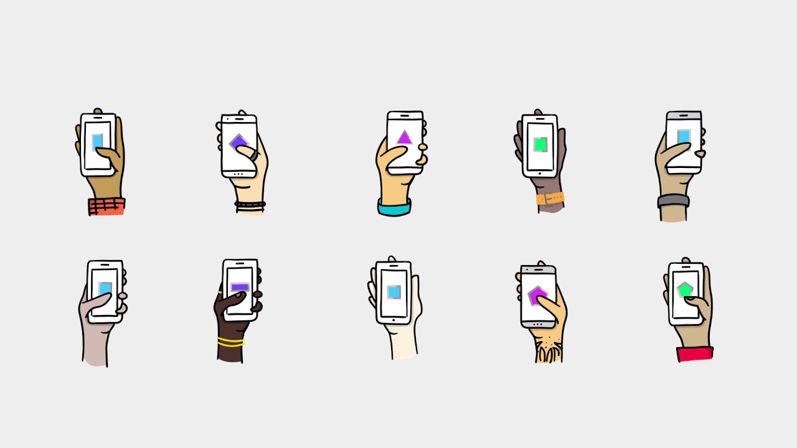
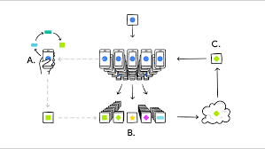

Data Science In Context
Federated Learning 
========================================================
author: Stephanie Roark
date: 12/05/2018
autosize: true

Federated Learning
========================================================

What is Federated Learning?

Federated Learning is machine learning where training data is distributed over a large number of clients each with unreliable and relatively slow network connections. The updates from these clients are used to train a high-quality centralized model which is then re-distributed to the clients.

- Cross device learning allows clients to collaborate without sharing data
- Clients are generally smart devices or edge devices
- On device predictions allow for more personalization
- Personal privacy is preserved by employing Secure Aggregation Protocol

Federated Learning Devices
========================================================

Typical clients are mobile devices

Centralized or Cloud AI
========================================================

Most Machine Learning happens in the cloud after collecting data and transferring to the cloud for training.

- Machine Learning often involves large volumes of data 
- Data is collected from user's devices and centralized in the cloud
- Training and Inference is then performed 
- The model predictions are transferred back to clients 

Drawbacks of Centralized AI
========================================================

- Reduced Privacy - increasing difficulty in securely transfering and storing data
- Incompatibility - industries which require confidentiality and security
        (health sector, insurance, bank, military etc)
- Latency issues - data is not available in real time (autonomous vehicles)
- High costs of transferring data

Federated learning vs. Centralized AI
========================================================

How to centralize modeling without high data transfer costs and while maintaining privacy?

- The model is distributed to the client
- Each client independently computes an update to the current model based on local data and communicates back to the global model 
- Updates consist of only the improvement or delta to the local model
- Allows users to benefit from improvements made by other devices while preserving privacy

Why is Federated Learning useful?
========================================================

- Thousands of changes are aggregated and combined allowing everyone to benefit from the collective improvement of numerous devices
- Since the updates are a summary of the local changes, the resulting data transer is significantly less costly and only transefered while plugged in or at rest
-  Model is located on the user’s device, allowing for real time inferences with no latency problems
- No personal data ever leaves the local device

Federated Learning Summary
========================================================

- Central model or algorithm downloaded by users
- New learnings or updates from each client model are securely aggregated and sent to the cloud
- The updates are used to train the centralized model
- New central model is then distributed again on every device where it completes the local model, accumulating updates made from all devices all the while staying personalized to each user

Secure Aggregation Protocol
========================================================

- Client devices send updates in groups which are coordinated
- Each client's update is encrypted by "perturbing" the data with noise
- When the group's updates are aggregated together, the noise cancels out, i.e. the sum of the perturbations is zero
- Only the client device knows it's own encryption or perturbation

Central Server Benefits
========================================================

- Central server selectively chooses groups to coordinate updates, spread out data collection and to control for biases
- Updates are ephemeral, focused(cleaned data) and an aggregate of the updates
- Security is maintained because the central server cannot read updates individually, only as an aggregate

Challenges of Federated Learning
========================================================

- Training data is stored across a massively distributed network of devices (difficult to coordinate updates)
- Unreliable connectivity or limited communications with devices (driving through tunnels, etc)
- Unbalanced data results from clients with large deltas vs. clients with small deltas
- Highly non-IID data as each users preferences and patterns reflected in the data
- Dynamic Data Availability - time zones, etc affect when the data is available to be collected

Applications of Federated Learning
========================================================

- On device data is more relevant than server side because the client devices have physical context (location) and virtual state (motion sensors,etc) resulting in better models 
- Keeping hypersenstive data on device allows for the safe use of medical or personal data to train models for new applications of AI which were impossible previously
- Language modeling for mobile keyboards or voice recognition
- Situations where users generate and label data implicitly themselves

Sources
========================================================

- Author, Publication Date, Paper Title, URL
- Jesus Rodriguez, 02-26-18, What's New in Deep Learning Research, https://towardsdatascience.com/whats-new-in-deep-learning-research-understanding-federated-learning-b14e7c3c6f89

- Gabriel de Vinzelles, 03-06-18, Federated Learning, a step closer towards confidential AI, https://hackernoon.com/federated-learning-a-step-closer-towards-confidential-ai-7ac4afa9b437

- Alex Ingerman, https://www.youtube.com/watch?v=UgiPrYhBYYo&feature=youtu.be

Sources Continued
========================================================

- Robin C. Geyer, Tassilo Klein, Moin Nabi, 12-20-17, Differentially Private Federated Learning: A Client Level Perspective, https://arxiv.org/abs/1712.07557

- Keith Bonawitz and Vladimir Ivanov and Ben Kreuter and Antonio Marcedone and H. Brendan McMahan and Sarvar Patel and Daniel Ramage and Aaron Segal and Karn Seth, 2016, Practical Secure Aggregation for Federated Learning on User-Held Data, https://ai.google/research/pubs/pub45808

- Brendan McMahan and Daniel Ramage, Research Scientists, 04-06-17, Federated Learning: Collaborative Machine Learning without Centralized Training Data, https://ai.googleblog.com/2017/04/federated-learning-collaborative.html

