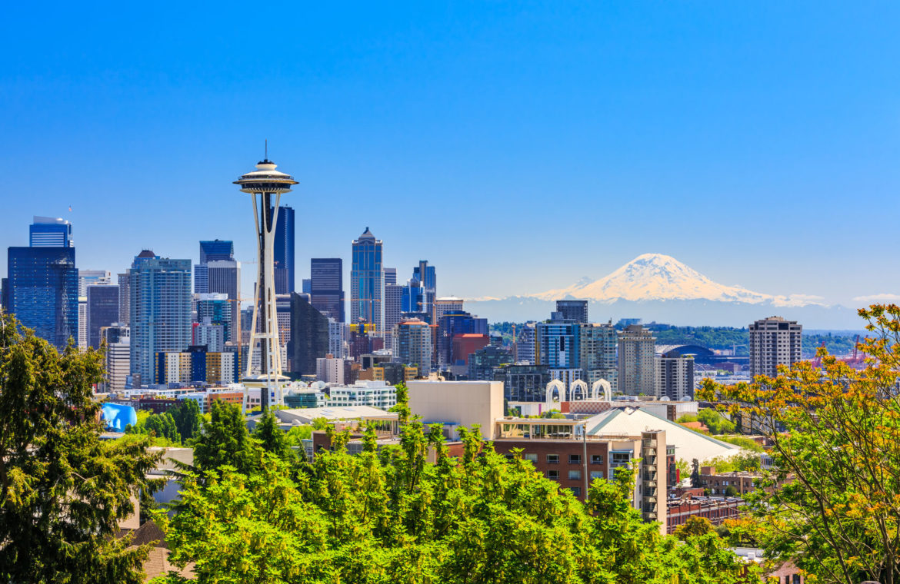

Seattle's Perfect Summer:  Fact or Fiction? 
========================================================
author: Stephanie Roark
date: 12-12-2018
autosize: true

Seattle's Perfect Summer Day
========================================================



Seattle's Perfect Summer: Fact or Fiction?
========================================================

Fact!

- The number of perfect weather days in Seattle is increasing on average every year!
- Perfect weather days tend to occur more in the summer time when the rain dries up
- Air quality issues of summer wildfires have not greatly impacted the number of perfect days 
- Weekends do not tend to be more rainy than weekdays in the summer time


Seattle's Perfect Summer: Fact or Fiction?
========================================================

Data: Talk about data and where obtained 

- NOAA's weather dataset measured at Seattle-Tacoma Airport (SeaTac) spanning from 1948 to present, containing 50 variables including both max and min temperature and precipitation: [Seattle Daily]("https://www.ncdc.noaa.gov/cdo-web/datasets/GHCND/stations/GHCND:USW00024233/detail")
- EPA's pre-generated air quality dataset with the air quality index by day for every county in the US and spanning from 01.01.1980 to 11.27.2018: [AQI]("https://aqs.epa.gov/aqsweb/airdata/download_files.html")
- Seattle events data: [Seattle Special Events Data]("https://www.events12.com/seattle/")


Temperature and Air Quality from 2012 to 2017 
========================================================

Consistent Temperature and Air Quailty Ranges


Rain Rain Rain 
========================================================


Precipitation 
========================================================

We can see gaps in precipitation


What is Perfect?
========================================================

working definition of perfect weather

- Temperature Range between 55 and 85 degrees F
- Air Quality index below 100 which is the max range for moderate air quality before the air quality becomes unhealthy for sensitive groups
- Precipitation less than or equal to 0.05 inches per day

Seattle's Pefect Days
========================================================

The Perfect Weather days tend to happen in middle of year


Predicting Perfect Weather Days
========================================================

The number of perfect days on average is increasing by 0.79 days per year


```
[1] 428
```

```
[1] 0.2790091
```


Weekends and Events
========================================================


- 428 perfect weather days  fall on weekends, which is 27.9% of the perfect weather days

- 22 events dates coincide with perfect weather dates and that these dates occur between June 1 and September 30

Conclusion - Follow up analysis
========================================================


Follow up analysis could compare other Pacific Northwest cities and/or cities around the US to see if Seattle's summer is really special.

