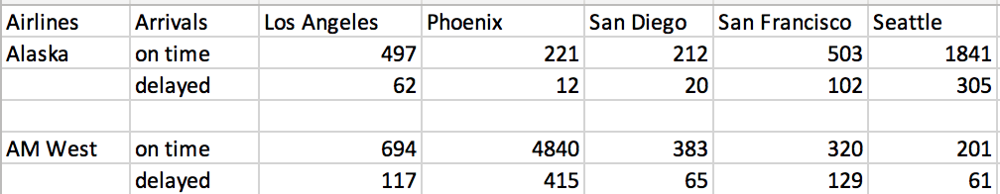

## Assignment – Tidying and Transforming Data





###The chart above describes arrival delays for two airlines across five destinations. 

Your task is to:

1.  Create a .CSV file (or optionally, a MySQL database!) that includes all of the information above. You’re encouraged to use a “wide” structure similar to how the information appears above, so that you can practice tidying and transformations as described below.
2.  Read the information from your .CSV file into R, and use tidyr and dplyr as needed to tidy
and transform your data.
3.  Perform analysis to compare the arrival delays for the two airlines.
4.  Your code should include narrative descriptions of your data cleanup work, analysis, and conclusions. 

##Read in the table from the .CSV file:
Reading in the table and removing the na's from the empty row.
```{r  read in data, eval=TRUE, message=FALSE, warning=FALSE}
library(tidyverse)
arrivals <- read.csv("Arrivals.csv", sep = ",", stringsAsFactors = FALSE) 

arrivals_wide  <- arrivals %>% drop_na()
arrivals_wide
str(arrivals_wide)
```

##Tidy the Data
Tidying the wide data by first cleaning up the Arrivals, replacing empty spaces with NA and trimming the empty space around Arrivals, followed by filling in the Airlines for each arrival. The final step is gathering the on time and delayed arrivals in each city and arranging by Airline:
```{r tidy data, eval=TRUE}

arrivals_long <- arrivals_wide %>% 
    mutate(Airline = ifelse(Airlines == "", NA, Airlines)) %>%
    mutate(Arrival = str_trim(Arrivals, side="both")) %>%
    select(-Airlines, -Arrivals) %>%
    fill(Airline, .direction = "down") %>%
    gather("City", "NumFlights", Los.Angeles:Seattle) %>%
    arrange(Airline)

arrivals_long
```

##Plot the Arrivals by Airline:
Comparing the on time arrival percentages for each airline.
```{r graph by Airline, eval=TRUE}
ggplot(arrivals_long, aes(x=Airline, y=NumFlights)) + 
    geom_bar(stat="identity", aes(fill=Arrival), position="fill") +
    ylab("Ratio of Flights") +
    coord_flip() +
    theme(legend.position = "top") 
```

AM West's on time percentages are higher than Alaska's when comparing the overall set of arrivals. 

##Plot the Arrivals by City:
And further comparing the arrival on time arrival percentages by city.
```{r graph by City, eval=TRUE}
ggplot(arrivals_long, aes(x=City, y=NumFlights)) + 
    geom_bar(stat="identity", aes(fill=Arrival), position="fill") +
    ylab("Ratio of Flights") +
    coord_flip() +
    theme(legend.position = "top") 

```

Phoenix has the best on time percentage while San Francsico has the worst on time arrival percentage.